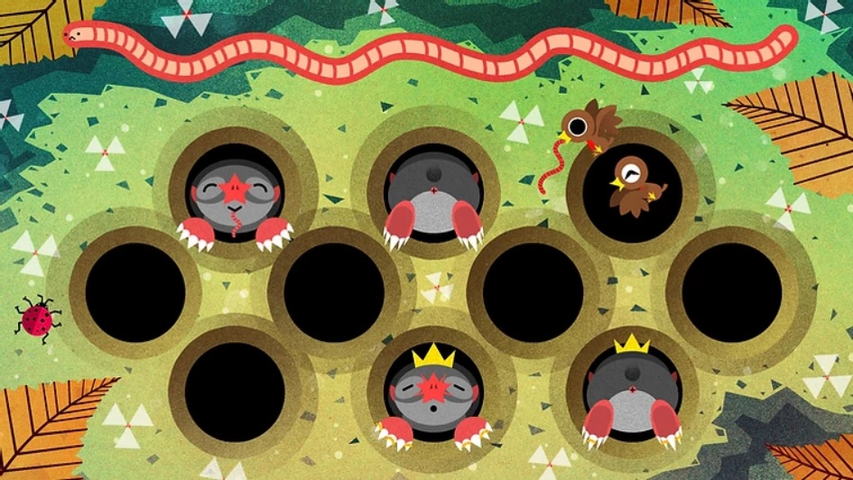

# Feed A Star Mole Game
**Demo:** https://hengameh.github.io/Feed-A-Star-Mole/

## Introduction
The idea is that little moles will pop out of holes and the game is to tap them before they go back in their holes. In our variant, they're hungry little star moles and we're going to feed them worms! After a user gets 10 points, they win the game! There are also more-rare royal star moles that are worth double. If a user doesn't click on a mole in time, the mole frowns and heads back in its hole. If you manage to feed it in time, it smiles happily and disappers back into its hole.

All the beautiful artwork has been drawn by the talented [Alice Brereton](https://www.pickledalice.com/). 

## Recommendations
Brian recommended that we should break down this project into steps rather than trying to do everything at once. Some sort of progression as below:

- Get all the CSS and HTML on the page. Have ten holes with a hungry mole in each. No JS done yet.
- Make the moles show up and disappear (don't worry about the sad face / butt yet.) Don't make them clickable yet, just have them disappear and reappear after a random interval.
- Make the hungry moles clickable. If you click on one, add 1 point to your score.
- After 10 clicks, show the win screen.
- Show the worm meter. As a player clicks on moles, show more and more of the worm.
- Make one in ten of the moles that show up a royal mole. If a user clicks a royal mole, add 2 points to their score.
- If a user doesn't click a mole in time, show a sad mole.
- If a user does click a mole in time, show a fed mole.
- After both sad and fed moles, show a mole butt.
- You're done!

Please feel free to play with the timing. In this version I used the following timings:

- Hungry moles show up for two seconds
- Sad, fed, and mole butts show for a half second.
- Moles wait at least two seconds before showing up in the same hole and no more than twenty seconds.

You can grab all the static images [here](https://frontendmasters.github.io/bootcamp/mole.zip)
This Excercise developed by [Brian Holt](https://frontendmasters.com/teachers/brian-holt/)

Licensed under the [MIT License](LICENSE)
